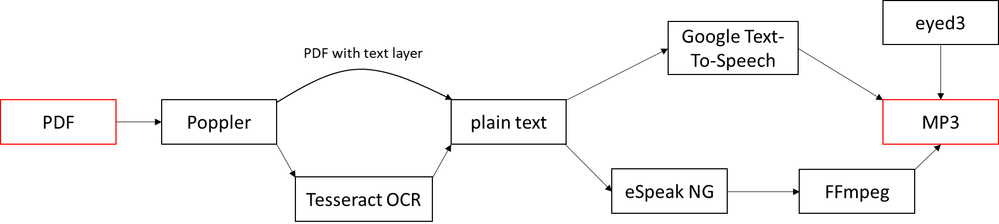

# pdf2mp3

## About

`pdf2mp3` extracts text from a pdf file, by either using [Poppler](https://poppler.freedesktop.org/) for extracting the text layer or [Tesseract OCR](https://github.com/tesseract-ocr/tesseract) for text recognition. The text is then processed via [eSpeak NG](https://github.com/espeak-ng/espeak-ng) together with [FFmpeg](https://www.ffmpeg.org/) or [Google Cloud Text-To-Speech](https://cloud.google.com/text-to-speech).

[](./doc/flowchart.png)

## Features

* Converts a PDF into an MP3
* Partial documents via `--page-start` and `--page-end`
* Optional text file (`--sidecar`)
* Two speech synthesizers: eSpeak NG and Google Cloud Text-To-Speech
* ID3 artist and title

## Installation

Required packages from the Python Package Index (PyPI):

* `eyed3`: manipulating ID3 metadata in MP3 files
* `google-cloud-texttospeech`: Google's Cloud Text-To-Speech Python API
* `progress`: Progress bars for Python
* `pydub`: Used to convert wav to mp3
* `pytesseract`: Tesseract OCR software
* `python-poppler`: Libpoppler is used for working with PDFs
* `py-espeak-ng`: eSpeak NG is on open source language synthesizer

OS (in this example on Ubuntu Linux):

* required: `python3-pip cmake espeak-ng ffmpeg libpoppler-cpp-dev pkg-config tesseract-ocr`
* optional: `tesseract-ocr-deu`, `tesseract-ocr-nld`, ...

Installation:

```text
$ sudo apt install python3-pip cmake espeak-ng ffmpeg libpoppler-cpp-dev pkg-config tesseract-ocr
$ pip3 install virtualenv
$ git clone 'https://github.com/rmainer/pdf2mp3.git'
$ virtualenv pdf2mp3
$ cd pdf2mp3
$ source bin/activate
$ pip install -r requirements.txt
```

## Google Cloud Text-To-Speech

If you intend to use Text-To-Speech:

* Head over to [Google's Cloud Console](https://console.cloud.google.com/)
* Create a Project
* Add the Text-To-Speech API
* Create a service account and save the `key.json`
* Choose a [voice](https://cloud.google.com/text-to-speech/docs/voices)
  * `--google-texttospeech-language-code <code>`
  * `--google-texttospeech-voice-name <name>`

## Notes

Sadly eSpeak NG, Google Text-To-Speech and Tesseract OCR use different language names:

* [Google Text-To-Speech](https://cloud.google.com/text-to-speech/docs/voices) for the `--google-texttospeech-language-code <code>` and `--google-texttospeech-voice-name <name>`
* eSpeak NG: `espeak-ng --voices` for the `--espeak-ng <lang>` option
* Tesseract OCR: `tesseract --list-langs` for the `--tesseract <lang>` option

## Command line options

```text
optional arguments:
  -h, --help            show this help message and exit
  --page-start <N>      Page to begin with, default: 1
  --page-end <N>        Page to end on, default: last page
  --dpi <num>           DPI for the page renderer, default: 150
  --tesseract <lang>    Use Tesseract OCR with given language
  --google-oauth2-key <file>
                        Use Google Text-To-Speech with the <key> file
  --google-texttospeech-language-code <code>
                        BCP-47 language tag, e.g. "en-US" or "de-DE"
  --google-texttospeech-voice-name <voice>
                        Google Text-To-Speech voice name
  --espeak-ng <lang>    Use Espeak NG with the given language
  --sidecar <file>      Saves the text to a txt file
  --mp3-artist <name>   ID3 artist
  --mp3-title <name>    ID3 title

required arguments:
  --input <file>        Source PDF file
  --output <file>       Destination MP3 file
```

## Examples

There are two examples in the [doc](./doc/) directory:

* [example-google](./doc/example-google.sh)
* [example-espeakng](/.doc/example-espeakng.sh)

To run these examples you first have to do the installation steps mentioned earlier and install the `tesseract-ocr-deu` package.
